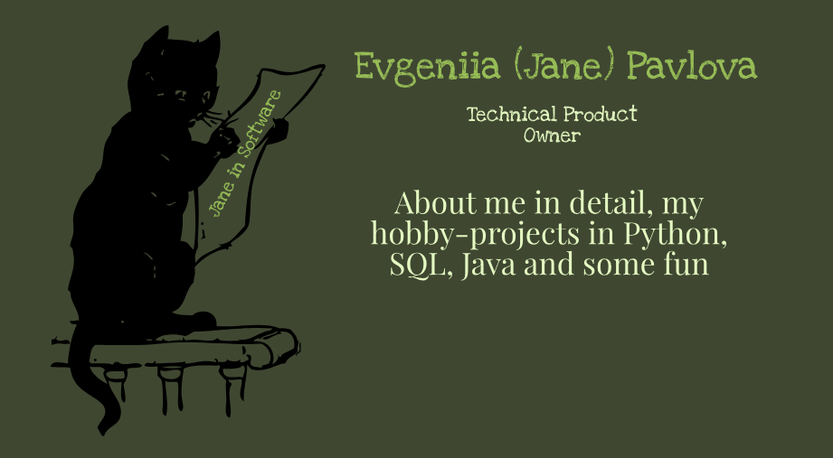

### 👋 Hello folks 

My name is Evgeniia (aka Jane) Pavlova and I'm a Technical Product Owner with a development and business system analysis background. I live in Northern Virginia but in general open to relocation in the Autumn of 2024. 

Now my professional experience spans over a decade (10+ years) and ever since I graduated with an engineering degree, I have bonded with the software development industry. I started as an ERP Software Developer and then transitioned naturally to System Analysis and Product Ownership, trying on different roles and lots of hats. 

### 🤔 Why?

You are a Product Owner - why to have GitHub, you may think. Well, I just love being on the edge of leadership and technology and strive to stay up-to-date with the evolving Tech industry. You need to understand how the product is evolving and where it should go, not just from users' perspective but from your technology stakeholders' (CTO, architects, developers, and all) point of view too! 

### 🤖 Special features

As a Technical Product Owner, I performed a great variety of engineering tasks for multiple years. For instance, relational databases design and advanced SQL querying, RESTful API design and testing, usage of version control (Git/GitHub), CI/CD (Jenkins, GitHub Actions), Docker, writing of test cases and test scenarios (using BDD and traditional approach), code documentation (e.g. with UML and requirements hooks) and requirements elicitation and management, wireframe creation etc, etc. 

I took some significant time in 2023 to do some professional education to enhance the topics I worked with already: Python and Java programming, Docker, AWS EC2 and storage, lambdas, and advanced computer science (algorithms and data structures). 

### 😍 My domains and memorable projects/products

I love everything I've done equally but some of them a tad bit more.

**healthcare** domain - I appreciate the impact on our society, and genuine motivation every day. I used to work for one of the biggest US pharma companies as well as healthcare providers. Both projects were challenging and rewarding. The first one was completely from scratch - a web-based laboratory mice production software, and the second - a completely re-engineered API ecosystem based on HL7 FHIR and suitable for EHR exchange (aka HIPAA compliant).

**automotive** domain - this is just exciting as I had an opportunity to work on the first-ever Linux-based automotive operating system. I mean - how many engineers do you know who did? The quality assurance, CI/CD automation, and software engineering practices used were top-notch. As tech savvy person, I enjoyed every second of it and learned tons of skills. We managed to achieve 100% requirements coverage for our first release and all were integrated into our CI/CD pipeline (we didn't have the full-blown CD, though, but I'll strive to get there)!

### 🚀 Technologies and tools 

* **Agile** Scrum Master PSM I🏅, Product Owner PSPO I🏅 certified by [Scrum.org](https://www.scrum.org/), Kanban Systems Design KSM I🏅 by [Kanban University](https://kanban.university/), SAFe Product Owner 🏅 certified by [Scaled Agile](https://scaledagile.com/)
* **Conventional waterfall** BRDs, SRSs, done Gantt diagrams and requirements traceability matrices, been there, done that, and more :D 
* **Standards and more** HL7, FHIR, OpenAPI 3.0, UML, BPMN, SOLID, DRY, OOP, SDLC, JSON, YAML, XML
* **Requirements** User Stories, Use Cases, BRD, SRS, DocBook
* **Development** Python, Java, CSS, HTML, JavaScript  
* **Tests** TDD (Pytest), BDD (Gherkin, Behave) 
* **CI/CD** Jenkins, GitHub Actions 
* **DevOps** Docker, Grafana, GitHub 
* **Cloud** AWS EC2, S3, SQSes 
* **Databases** SQL (MS SQL, Postgres, SQLite, MySQL)
* **Unix** Linux (Ubuntu), Shell 
* **Tools** Confluence, JIRA, Postman, SwaggerHub, InVision, Balsamiq, Redash, PowerBI 

### 🌱 Currently learning

In the middle of learning some serious AI, started with [CS50’s Introduction to Artificial Intelligence with Python](https://cs50.harvard.edu/ai/2023). This course explores the concepts and algorithms at the foundation of modern artificial intelligence, diving into the ideas that give rise to technologies like game-playing engines, handwriting recognition, and machine translation. Also, I'm deepening my knowledge of Java.

### 📫 You can reach out to me 

You can find me on  or drop an email at pavlova.jane@gmail.com (you can
rely on a zero-inbox policy I stick to 🤝)

### ⚡ Some fun

A Pythonista at heart, I'm also a big fan of Monthy Python anything. So I have created a tribute [API in their honor](https://github.com/pavlovajane/cs50p-final-project/blob/main/README.md) with a CLI and some data-scrapping involved. Now we can enjoy the best quotes from their masterpieces (with a bit of remarkable work with dependencies under the hood of the server 🤓). 

> Some things in life are bad
>  They can really make you mad
>  Other things just make you swear and curse
>  When you're chewing on life's gristle
>  Don't grumble, give a whistle
>  And this'll help things turn out for the best
